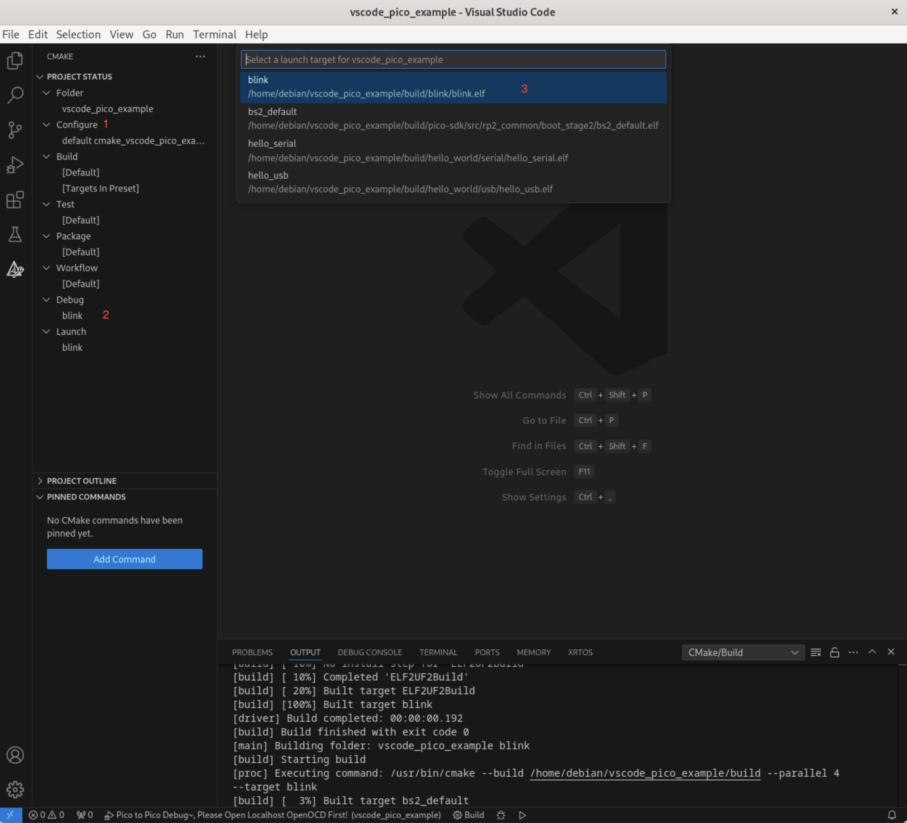
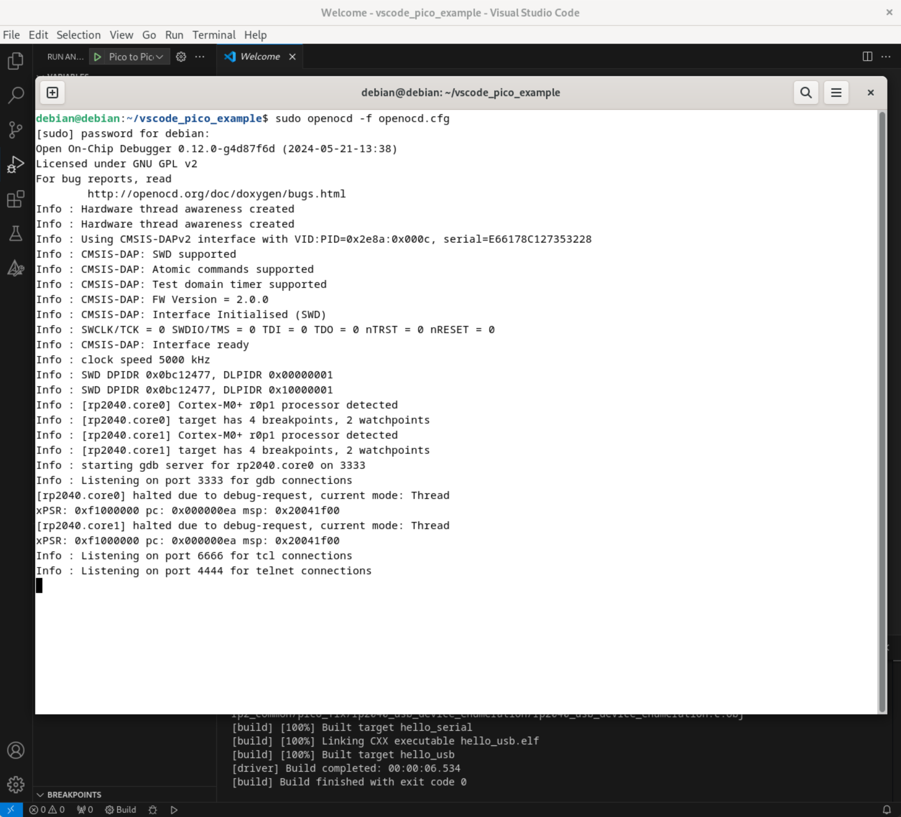
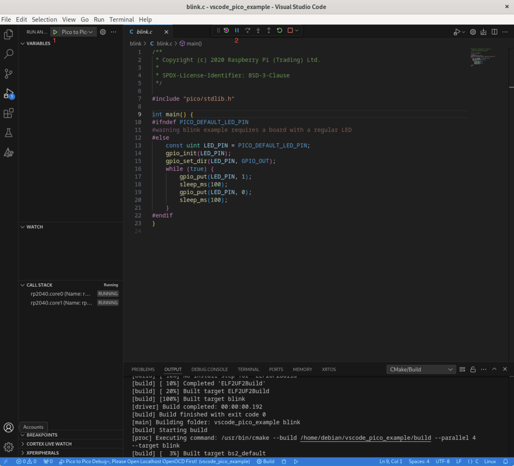
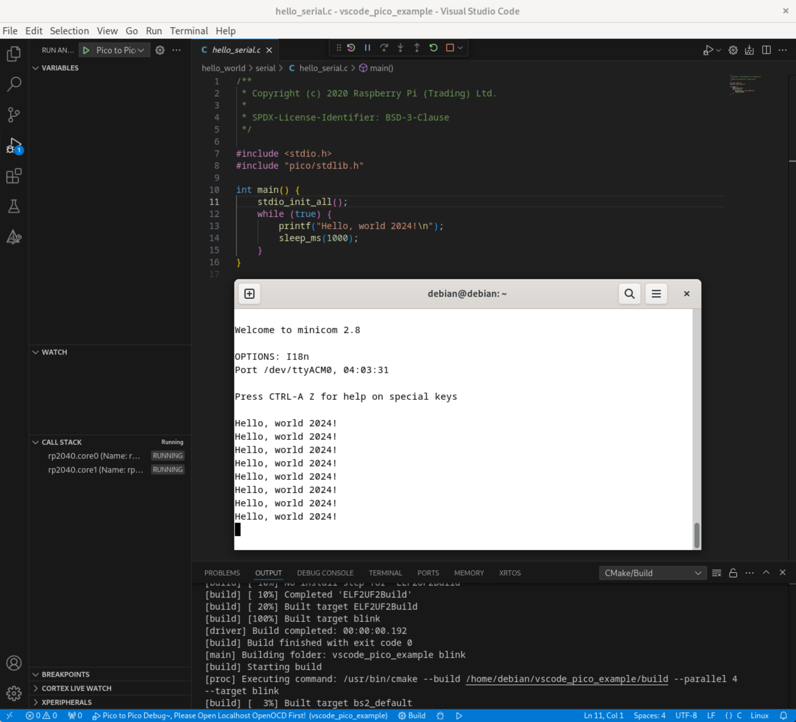

# 树莓派 Pico 调试另一个 Pico  

## 1. 环境安装
-----

###### 1. 下载安装脚本，更改为可执行文件

```
wget https://raw.githubusercontent.com/raspberrypi/pico-setup/master/pico_setup.sh
```
```
chmod +x pico_setup.sh
```

###### 2. 更新pkg

```
sudo apt-get update
sudo apt-get install pkg-config
```

###### 3. 下载树莓派官方实例、SDK

```
./pico_setup.sh
```

###### 脚本将:
* Create a directory called `pico`
* Install required dependencies
* Download the `pico-sdk`, `pico-examples`, `pico-extras`, and `pico-playground` repositories
* Define `PICO_SDK_PATH`, `PICO_EXAMPLES_PATH`, `PICO_EXTRAS_PATH`, and `PICO_PLAYGROUND_PATH` in your ~/.bashrc
* Build the `blink` and `hello_world` examples in `pico-examples/build/blink` and `pico-examples/build/hello_world`
* Download and build `picotool` (see [getting-started-with-pico.pdf](getting-started-with-pico.pdf) Appendix B), and copy it to `/usr/local/bin.`
* Download and build `debugprobe` (see [getting-started-with-pico.pdf](getting-started-with-pico.pdf) Appendix A).
* Download and compile OpenOCD (for debug support)
* Download and install `Visual Studio Code`
* Install the required Visual Studio Code extensions (see [getting-started-with-pico.pdf](getting-started-with-pico.pdf) Chapter 7 for more details)
* Configure the Raspberry Pi UART for use with Raspberry Pi Pico  

###### 4. 安装成功后，重新启动
```
sudo reboot
```

## 2. 按图连接条线 （左 Pico A，右 Pico B）
-------------


## 3. 将debugprobe固件写入 Pico A
----------------
1. 下载 [debugprobe_on_pico.uf2](https://github.com/raspberrypi/debugprobe/releases/download/debugprobe-v2.0.1/debugprobe_on_pico.uf2) 文件
2. 拷贝`debugprobe_on_pico.uf2`到`Pico A`
* 按住 `BOOTSEL` 按钮，将连接电脑`USB`线插入`Pico A`
* 出现`RPI-RP2`盘符，将`debugprobe_on_pico.uf2`文件拖拽到`RPI-RP2`盘符
3. `Pico A` 自动重启
## 4. 调试 Pico B
----------------
###### 1. 编译`blink.c`

```
cd ~/pico/pico-examples/
rm -rf build
mkdir build
cd build
export PICO_SDK_PATH=../../pico-sdk
cmake -DCMAKE_BUILD_TYPE=Debug ..
cd blink
make -j4
```

###### 2. 烧录到 `Pico B`
```
sudo openocd -f interface/cmsis-dap.cfg -f target/rp2040.cfg -c "adapter speed 5000" -c "program blink.elf verify reset exit"
```

###### 命令参数说明

| 参数 | 功能 |
|---|---|
| cmsis-dap.cfg | 调用的类型文件（Pico A） |
| rp2040.cfg | 调用的类型文件（Pico B） |
| adapter speed 5000 | 速率 |
| program blink.elf | 程序 blink.elf |
| verify | 校验 |
| reset | 重置 |
| exit | 退出 |

###### 3. 灯闪亮  

<details>
<summary>更多例子</summary>

###### cd 到 ~/pico/pico-examples/build 目录下，编译全部实例
```
cd ~/pico/pico-examples/build
make -j4
```
* ###### 烧录 blink 目录下 blink.elf 文件
```
sudo openocd -f interface/cmsis-dap.cfg -f target/rp2040.cfg -c "adapter speed 5000" -c "program blink/blink.elf verify reset exit"
```
* ###### 烧录 hello_world 目录下 serial 下的 hello_serial.elf 文件
```
sudo openocd -f interface/cmsis-dap.cfg -f target/rp2040.cfg -c "adapter speed 5000" -c "program hello_world/serial/hello_serial.elf verify reset exit"
```
</details>  

## 使用 VSCODE 调试 Pico B
----------
  
###### 1. 下载 `vscode_pico_example`， 用 VSCODE 打开 `vscode_pico_example`  
###### 2. 在VSCODE里安装 `CMake Tools`  
###### 3. 配置CMake Tools
###### * 1. 配置 Configure（default cmake_vscode_pico_example）
###### * 2. 配置 Build (Default)
###### * 3. 配置 Debug (Blink)
  
###### 4. 启动 openOCD  
```
sudo openocd -f openocd.cfg
```
  
###### 5. 调试 Pico B  
* ###### 1. 点击 Start Debugging（VSCODE -- DEBUG -- 绿色三角形）  
* ###### 2. 点击 Continue 按钮 (调试工具栏 -- 第二个按钮)  
  
* ###### 3. Pico 灯 将闪烁
* ###### 4. 点击 Stop 按钮，停止调试

###### 6. 调试hello_serial实例
* ###### 1. `CMake Tools` -- 设置 `Debug` 为 `hello_serial`
* ###### 2. 重复步骤`5.调试 Pico`

###### 7. 监听 Serial 口
* ###### 1. 安装`minicom`  
```
sudo apt install minicom
```
* ###### 2. 监听ACM0端口  
```
sudo minicom -D /dev/ttyACM0
```
  


###### 更多参考PDF [getting-started-with-pico.pdf](getting-started-with-pico.pdf) , [openocd.pdf](openocd.pdf)文档  
