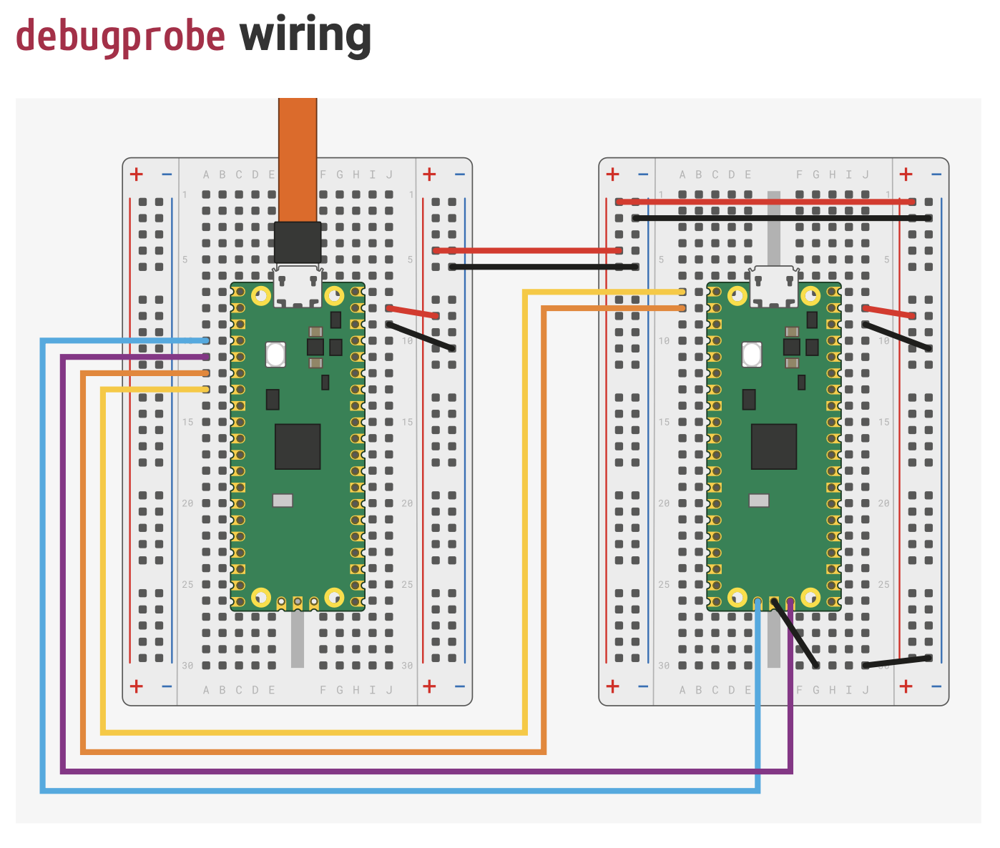

# raspberry_pico_debug_with_a_second_pico

# 1.安装环境
1. 下载安装脚本

```
wget https://raw.githubusercontent.com/raspberrypi/pico-setup/master/pico_setup.sh
```

2. 更改为可执行文件

```
chmod +x pico_setup.sh
```

3. 执行脚本

```
./pico_setup.sh
```

4. 安装成功后，重新启动
```
sudo reboot
```


# 2. 烧录 Pico A （图左 Pico）
1. 下载UF2文件
    https://github.com/raspberrypi/debugprobe/releases/tag/debugprobe-v2.0.1 的 debugprobe_on_pico.uf2

2. 拷贝UF2到Pico A
    1. 按住 BOOTSEL 按钮， 将连接电脑USB线插入pico
    2. 出现 U盘符
    3. 将 debugprobe_on_pico.uf2 文件拖拽到U盘符


# 按图连接条线


# 3. 调试 Pico B （图右 Pico）

#pico/目录说明
pico-examples   #例子
pico-sdk        #SDK位置
openocd         #openocd调试工具
...


1. 编译

```
cd ~/pico/pico-examples/
rm -rf build
mkdir build
cd build
export PICO_SDK_PATH=../../pico-sdk
cmake -DCMAKE_BUILD_TYPE=Debug ..
cd blink
make -j4
```

2. 烧录到 Pico B
```
sudo openocd -f interface/cmsis-dap.cfg -f target/rp2040.cfg -c "adapter speed 5000" -c "program blink.elf verify reset exit"
```
#参数说明
cmsis-dap.cfg       #A 调用的类型文件（Pico A）
rp2040.cfg          #B 调用的类型文件（Pico B）
adapter speed 5000  #速率
program blink.elf   #程序 blink.elf
verify              #校验
reset               #重置
exit                #退出

3. 查看灯是否闪亮

